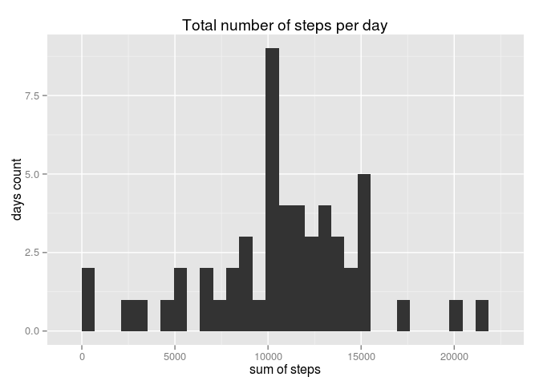

# Reproducible Research: Peer Assessment 1


## Loading and preprocessing the data

```r
library(dplyr)
```

```
## 
## Attaching package: 'dplyr'
## 
## The following object is masked from 'package:stats':
## 
##     filter
## 
## The following objects are masked from 'package:base':
## 
##     intersect, setdiff, setequal, union
```

```r
library(ggplot2)
data <- read.csv("activity.csv")
data$date <- as.Date(data$date)
```


## What is mean total number of steps taken per day?

```r
step_sum <- aggregate(steps ~ date, data, sum)
# histogram of steps' sum per day
qplot(step_sum$steps, main = "Total number of steps per day", xlab = "sum of steps", ylab = "days count")
```

 

```r
# calculate mean and median values of step' sum per day
steps_mn <- mean(step_sum$steps)
steps_md <- median(step_sum$steps)
print(paste("mean value = ", steps_mn))
```

```
## [1] "mean value =  10766.1886792453"
```

```r
print(paste("median value = ", steps_md))
```

```
## [1] "median value =  10765"
```
Results of calculations:  
mean value for total number of steps per day is **10766.19**  
median value is **10765**


## What is the average daily activity pattern?

```r
avg_group <- group_by(data, interval)
step_avg <- summarize(avg_group, mean = mean(steps, na.rm = TRUE), med = median(steps, na.rm = TRUE))
qplot(step_avg$interval, step_avg$mean, main = "Average count of step in all days", xlab = "time interval", ylab = "steps count", geom = "line")
```

 

```r
max_interval <- subset(step_avg, mean == max(mean))
max_interval$interval
```

```
## [1] 835
```
Maximum number of steps across all days in the dataset in **835** 5-minute interval

## Imputing missing values

```r
# computing count of missing values
na_count <- sum(is.na(data$steps))
print(paste("count of missing values = ", na_count))
```

```
## [1] "count of missing values =  2304"
```

```r
# imputing missing values
# we populate imputing values mean of 5-minute interval for all days
join_data <- merge(data, step_avg, by = "interval")
join_data$steps[is.na(join_data$steps)] <- join_data$mean
```

```
## Warning in join_data$steps[is.na(join_data$steps)] <- join_data$mean:
## число единиц для замены не является произведением длины замены
```

```r
join_data$med <- NULL
join_data$mean <- NULL

# plotting histogram without missing values and mean/median values
group_data_new <- group_by(join_data, date)
step_sum_new <- summarize(group_data_new, sum = sum(steps))
qplot(step_sum_new$sum, main = "Total number of steps per day", xlab = "sum of steps", ylab = "days count")
```

 

```r
steps_mn_new <- mean(step_sum_new$sum)
steps_md_new <- median(step_sum_new$sum)

print(paste("mean value for cleaned dataset = ", steps_mn_new))
```

```
## [1] "mean value for cleaned dataset =  9371.43705536653"
```

```r
print(paste("median value for cleaned dataset = ", steps_md_new))
```

```
## [1] "median value for cleaned dataset =  10395"
```
Results of calculations:  
mean value for total number of steps per day is **9371.44**  
median value is **10395**  
For cleaned dataset mean and median values lower then in original dataset.

## Are there differences in activity patterns between weekdays and weekends?

```r
join_data <- mutate(join_data, dtype = weekdays(join_data$date))
join_data$dtype[join_data$dtype == "Суббота" | join_data$dtype == "Воскресенье"] <- "weekend"
join_data$dtype[join_data$dtype != "weekend"] <- "weekday"
join_data$dtype <- as.factor(join_data$dtype)
avg_group_new <- group_by(join_data, dtype,interval)
step_avg_new <- summarize(avg_group_new, mean = mean(steps))
qplot(interval, mean, data = step_avg_new, main = "Average count of step in all days", xlab = "time interval", ylab = "steps count", geom = "line", facets = dtype ~ .)
```

 
